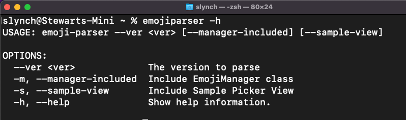

# emojiParser

92% of the world’s online population use emoji in their communications – and Unicode defines the characters that make those human connections possible. The Unicode Emoji Subcommittee regularly reviews proposals for new emoji and from time to time a new release is provided.

You can find a list of all releases from here

https://unicode.org/Public/emoji/

This command line tool will allow you to specify one of these versions (must be v4.0 or higher) and will generate an **emoji.json** file and optionally a Swift EmojiManager class (thanks @jordibruin) and sample view that can be used in a SwiftUI project.


### Building a Command Line Tool for Release

You can choose to fork or clone this repo and build and install the command line tool if you wish.  You can find instructions for that at this point in the video that I created on building your own Command Line utilities

https://youtu.be/pQt71tLmiac?t=1073

### Installing using Mint

One of the issues with sharing compiled applications for the mac is that they have to be notorized by Apple for security reasons and this can be, for a Command Line tool, an aduous task that I would prefer not to get into for this project.  However, you can install direcly using Mint so that you will be able to use it.

#### Install Homebrew and Mint

###### Homebrew

This will require that you install Mint first using Homebrew.  You can find out how to install Hombrew by going to the HomeBrew website.

`````swift
https://brew.sh
`````

###### Mint

Once Homebrew is installed, you can install Mint

`````swift
brew install Mint
`````

### Installing emojiParser

You can now install **emojiParser**

 `````swift
 mint install StewartLynch/emojiParser
 `````

Before you can effectively use emojiParser, you are going to have to make sure that the Mint directory where the installed command line tools are stored is in your /etc/paths location

1. Open terminal and open  the paths file using nano
   `````swift
   sudo nano /etc/paths
   `````

2. Add the path to the mint directory to that file.  For example, I am logged in as slynch so that path is
   `````swift
   /Users/slynch/.mint/bin
   `````

3. Save by issuing the commands ⌃O and then ⌃X  to save and exit
4. Exit Terminal you should be good to go to continue with the following instructions

### Basic Usage

Open terminal in any directory you like and then you can use the command line tool to generate the file(s) in that location.

##### Get help to show all options

`````
emojiparser -h
`````



### Required

##### Generate the json file for a particular version (example 14.0)

`````
emojiparser --ver 14.0
`````

### Optional

##### Generate the json file for a particular version (example 14.0) AND generate Jordi Bruin's EmojiManager class

`````
emojiparser --ver 14.0 -m
`````

##### Generate the json file for a particular version (example 14.0) AND generate a sample EmojiPickerView

`````
emojiparser --ver 14.0 -s
`````

##### Generate the json file for a particular version (example 14.0) AND generate the EmojiManager class AND the sample EmojiPickerView

`````
emojiparser --ver 14.0 -ms
`````
